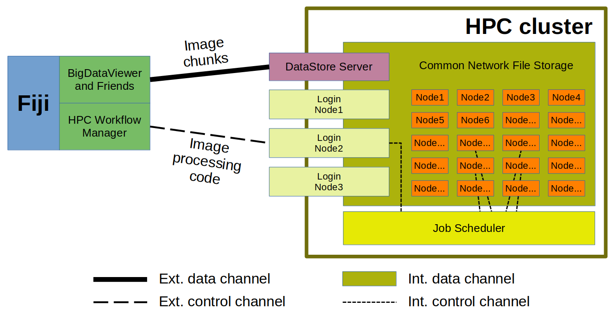

# Applications:

## A Storage-Independent Image Fileformat
Consider the following. Start a local server.
Create there and work with some dataset on it (locally), later move the data elsewhere without
changing the addressing path (well, except for the host, port and dataset name -- because the
*DatasetsRegisterService* defines dataset names on its own to avoid name clashes).

The expectation is that moving the main folder with DataStore data within a local file
system amounts to restarting the DataStore server on the new path, client code remains
unaffected. It should work similarly even for changing the storage backend, e.g., when
moving the data into an object storage. Last but not least, implementing the DataStore
communication protocol, which is rather primitive one with very limited number of commands,
in a new programming language could be an option for some than implementing a complex TIFF
loader in it.

## Gateway to S3 Storage
As discussed above, the client-server paradigm necessitates that DataStore clients
talk only the [DataStore HTTP communication protocol](https://docs.google.com/document/d/1ZeLc83dyNE9USBuvSCLEVGK-zQzUKFb7VGhOlVIRBvU/edit)
to reach their image data. Any storage peculiarities on the server-side are hidden
from the DataStore clients. In other words, the DataStore server can be understood as
a gateway to other means of storage, be it format-wise or transfer-wise, as long as it
compatible with the N5 API.

The object storage reached via the S3 protocol can be then
employed without any significant change in the client code or macros.
But to tell the truth, we haven't yet tested this opportunity.

## BDV, Mastodon and Friends
This is probably the most interesting application. See [how we came to it.](HISTORY.md)

The DataStore server, its *DatasetsRegisterService* in particular, can mimic BigDataServer
allowing to browse DataStore's content with BigDataViewer. And there are two ways to do it.

### BDV Browses BDS
As [exemplified](../README.md#testing-it-with-bigdataviewer) already, dataset content
can be reached from Fiji menu: *Plugins* -> *BigDataViewer* -> *Browse BigDataServer*.
The BigDataServer (BDS) remote URL is easily created as follows:

```
http://HOST:PORT/bdv/DATASETID
```

where `HOST:PORT` is an address to some *DatasetsRegisterService*
and `DATASETID` is the name of a dataset hosted by that server.

Notice the `bdv` inset in the URL, it's important.

### BDV Opens Tailored XML
A dataset designed specifically for the BigDataViewer is always defined with a XML file
with suitable, BDV-specific tags. The XML file for a particular version `V` of a `DATASETID`
that is hosted by a DataStore server at `HOST:PORT` can be obtained by saving the content at
the URL

```
http://HOST:PORT/bdv/DATASETID/V
```

that can be achieved, for example, with

```
wget http://HOST:PORT/bdv/DATASETID/V -O remote_dataset.xml
```

or with

```
curl http://HOST:PORT/bdv/DATASETID/V -o remote_dataset.xml
```

or just by opening the URL in a web browser and "saving the page".

Be sure to always download an updated XML from the DataStore server
every time the dataset "geometry" is changed, e.g.,
[after adding a new channel](FEATURES.md#adding-a-new-channel-to-existing-dataset).

Also note that the [mixed versioning](FEATURES.md#mixing-of-versions) cannot be used yet in conjunction
with BigDataViewer until we develop own BigDataViewer reading module for the DataStore as
[discussed at the end of this section](DESCRIPTION.md#connection-scheme). In particular,
[the `mixedLatest` or even `latest` keywords to specify a dataset version](DESCRIPTION.md#versions-of-data)
cannot be used.

To see which versions are actually currently available, extend the URL
with `/json`, for example as

```
http://HOST:PORT/bdv/DATASETID/V/json
```

and open it in a web browser. It usually shows human-readable formatted text that lists available version.
In fact, exactly this content is provided to the [browsing option above.](#bdv-browses-bds)

## HPC Cluster

