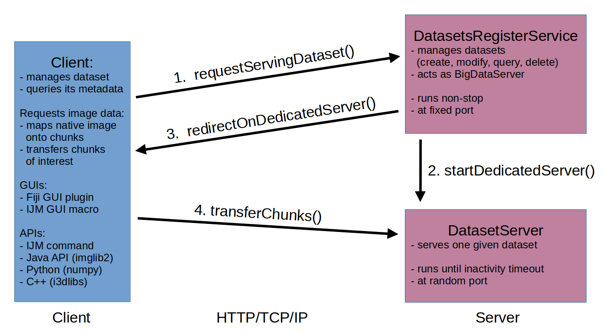
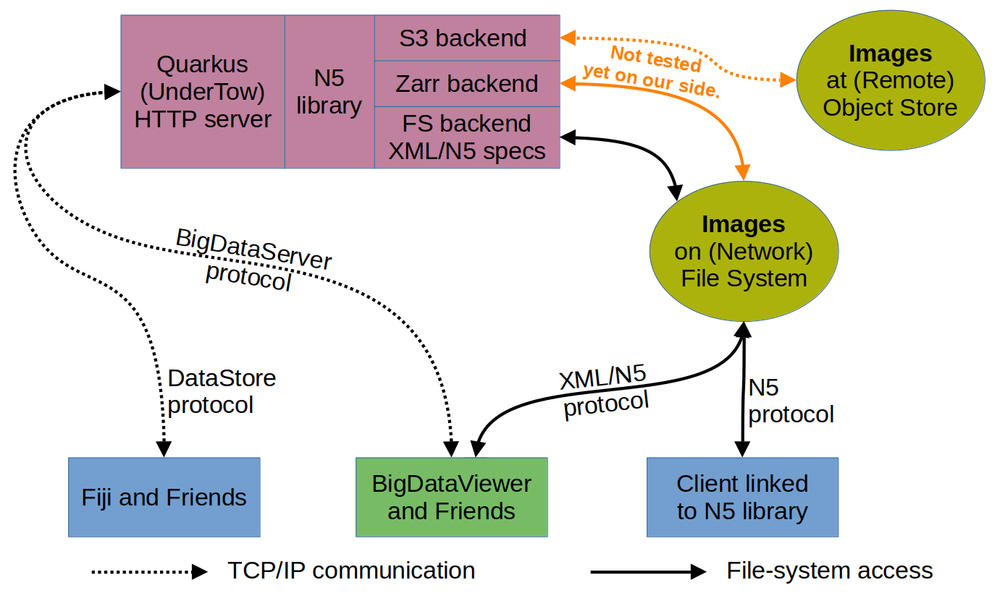
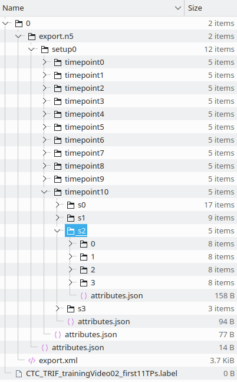

# Description
## Connection Scheme
The DataStore project is around the client-server principle, and it is summarized below:



The server-side is running a persistent server *DatasetsRegisterService* that is the first point
of contact to any client. This server manages most "light-weight" operations on its own, examples
are creating, changing, deleting and foremost querying datasets.

If the client decides it wants to download/upload image data, the *DatasetsRegisterService*, upon
client's notification, starts a *DatasetServer* dedicated to the particular requested image dataset,
and redirects the client on it. The client than communicates raw image data with the server. The client,
of course, can communicate with the *DatasetsRegisterService* anytime again and can have more *DatasetServer*s
opened simultaneously. The life-span of every such *DatasetServer* is limited with client-provided inactivity
timeout period, after which it self-closes.

In principle, the *DatasetsRegisterService* can open *DatasetServer*s on another machine to avoid
overloading of the machine with the persistent *DatasetsRegisterService* and/or to distribute the network
load if all serving machines are connected to the same network file system.

For the compatibility reasons with the original BigDataViewer-BigDataServer communication protocol,
the *DatasetsRegisterService* is [handling any remote BigDataViewer data queries](APPLICATIONS.md#bdv-mastodon-and-friends)
on its own too.

We plan to implement a DataStore-specific reader for the BigDataViewer, a reader
that would include most of the features DataStore is offering (like data versions and versions mixing, or
the communication with dedicated *DatasetServer*) and would present them fluently inside the BigDataViewer.

## Storage Architecture
The figure below summarizes various ways to reach the same data.
Storage systems are in yellow circles, top right. These are where the image data is held.
The DataStore server is in purple, top left. Clients are listed at the bottom.
Dotted lines represent remote communication while solid lines is for local communication
(which, just like in NFS or SAMBA, can be hiding network communication underneath).
Orange paths are technically possible but haven’t been explored yet in this project.
Thus, there are no connection links drawn from the storage to match the orange paths.
But these paths are definitively worth exploring! In fact, we probably want to
deprecate the XML/N5 dialect, in favour of Zarr.



As hinted already, the server is by default using the [N5](https://github.com/saalfeldlab/n5)
with the [file-system backend](https://github.com/saalfeldlab/n5#file-system-specification),
in the XML/N5 dialect (explained just below). Considering only the images on the file system,
any N5 client that additionally understands the XML/N5 dialect can work directly with the data too.
Alternatively, the SPIM API may be used in the client (and taken directly on the `export.xml`).
The BigDataViewer itself is the most prominent example of this approach.

The official way, however, is reaching the data via the DataStore server. Here, one can use
the BigDataViewer (or the underlying SPIM API) in [conjunction with the server](APPLICATIONS.md#bdv-mastodon-and-friends)
in place of the BigDataServer itself. Or, simply any [DataStore client](#clients), such as
the [convenient GUI client in Fiji](https://github.com/fiji-hpc/hpc-datastore-fiji), achieves
the same but in full-duplex.

Both options, direct access and via the DataStore server, offer equal full-fledged ways
to reach the same data.

It is, nevertheless, possible (thought not tested yet) to operate the server with the
[AWS-S3 backend](https://github.com/saalfeldlab/n5-aws-s3) in N5 and use the server as
a gateway to some S3 storage. The user's application may consume the S3 content
"transparently" via its [DataStore client](https://github.com/fiji-hpc/hpc-datastore-fiji)
and its connection to the DataStore server.

### The BDV Dialect
In any case, N5 still needs to be instructed how to store the chunks--files. Currently,
we are doing it the XML/N5-way so that BigDataViewer can read the data directly.
This is what the layout may look like:



Notice the folder `export.n5` and the file `export.xml`, which is a typical sign for this N5 dialect.
The top-level folder `0` refers to a version of this dataset (explained below).

## Chunks
One "physical" image (i.e., at one particular time point, at one particular channel, angle and
resolution level) is stored as multiple 3D blocks which we call *chunks*. The chunk is contiguous
3D volume. The size (lengths along all each dimension) of all chunks is fixed within the resolution
level with the exception of the "upper-border" blocks that can be shorter in any dimension.
The chunks "factor" the original image, that said, no two chunks have non-empty intersection
yet union of all chunks makes up the image completely. Chunks are in principle synonyms to image
blocks, tiles or ROIs.

It is legal to have missing chunks. In fact, every newly created dataset is missing all its chunks initially.
Client has to upload chunks it desires to have stored. When a missing chunk is requested, the [server
returns special code to indicate it](https://github.com/fiji-hpc/hpc-datastore-fiji/blob/2ed6aa2c05672513ea02c83636d52f6e7d0e26a7/src/main/java/cz/it4i/fiji/legacy/common/ImagePlusTransferrer.java#L204)
and the client should detect it and handle it somehow.

The chunk sizes are defined when a dataset is being created, and cannot be changed anytime afterwards.
Client has to provide the sizes, one chunk size for each resolution level. The chunk size is the same
for all time points, channels and angles at the same resolution level.

The chunk sizes can be [queried anytime from the *DatasetsRegisterService*](FEATURES.md#querying-the-datastore-server) for every dataset.

## Multi-resolution
One "physical" image is stored at multiple copies, which are called *resolution levels*.
Typically, there is always a base-level (aka full-resolution) copy and a few smaller (down-scaled,
lower-resolution) copies more. Together it shall build a resolution pyramid.

The resolution level is defined in this project with strings like `[rx, ry, rz]` where `rx` is an integer
that says down-scale ratio, e.g., 2-times smaller or 4-times smaller, for the `x` axis, and similarly
for the remaining axes. The ratios for one resolution level may vary among the axes.
The base-level is thus described as `[1, 1, 1]`.

The resolution levels are defined when a dataset is being created, and cannot be changed anytime afterwards.
Client has to provide the down-scale ratios, one triple for each resolution level. The resolution level is
the same for all time points, channels and angles. Clearly, at least one resolution has to be defined (not
necessarily the base-level one).

The resolution levels can be [queried anytime from the *DatasetsRegisterService*](FEATURES.md#querying-the-datastore-server) for every dataset.

## Versions of Data
Besides the six dimensions (x,y,z,time,channel,angle) we provide one more which we call *versions*.
Technically, it is implemented as yet another full dataset [(notice the top-level folder `0` in the file listing)](#the-bdv-dialect)
with the same chunk sizes, resolution levels, number of time points, channels and angles, voxel type,
compression scheme, etc. The "alter-ego" datasets may be sparse again (i.e., with missing chunks).

The motivation is that one typically creates many versions of a test image during the development of an
image processing algorithm. One typically saves the versions of the test image as separate files to have
data to compare and evaluate whatever is the objective of the developing image processing. The versions here
follow exactly this paradigm but rather than creating and naming new datasets, the versioning is within one
dataset, which could simplify a couple of technical finesses.

The most interesting feature is the version mixing during which the *DatasetServer* fetches chunks
from the highest version available. This way, one can update (i.e., upload into a new version) only
a portion of the image (e.g., only chunks that display any part of an embryo, or chunks into which
a scale bar was in-printed) but have the "locally-updated" image composed and displayed.
The other use case is simply the ability to have revisions, to create new and delete old.

The versions are chosen with the `versionasstr` parameter in the macros, or the GUI dialog windows.
The currently available versions can be [queried anytime from the *DatasetsRegisterService*](FEATURES.md#querying-the-datastore-server) for every dataset.
However, a few special version keys are recognized:

- `new` - when uploading chunks/image, the image arrives into the next new version of that dataset,
- `latest` - when downloading chunks/image, the latest/highest available version of that dataset is found and used for *all chunks*,
- `mixedLatest` - as above, but *per chunks*.

Clearly, some combinations lead to an error, such as requesting to download image at a `new` version.
The keyword `latest`, however, works in conjunction with both reading and writing chunks. In fact,
the popular pattern to write content into a new version is to upload the first chunk into the `new` version,
and any following chunks into the `latest` version (which happens to be the one just created).

Also note that one does not need to create always a new version of a chunk when uploading it to the DataStore.
It is perfectly possible to just overwrite any existing version, even an older one.
One may also delete existing versions, leaving "holes" in the list of available versions.

## N5, Zarr and NGFF
The server-side can be understood [as an HTTP server with own addressing scheme](https://docs.google.com/document/d/1ZeLc83dyNE9USBuvSCLEVGK-zQzUKFb7VGhOlVIRBvU/edit)
that wraps around the N5 API. As hinted [above](#connection-scheme) it is possible
to switch to using the Zarr N5 backend in the NGFF dialect.

:tada: __DataStore is actively working on storing data in [NGFF OME.Zarr](https://ngff.openmicroscopy.org/latest/)__ :sparkles::sparkles:

## Clients
We anticipate an ensemble of DataStore clients written in Java, Python and C++. At the
moment, we have a [reference Java client in the form of Fiji plugin](https://github.com/fiji-hpc/hpc-datastore-fiji).

This is the current ensemble of available Fiji GUI plugins for the client side:


An [`imglib2`](https://imagej.net/libs/imglib2/) image data representation that would
be backed by the DataStore server is also on our road map. This would allow the image
processing developer to focus solely on implementing algorithms on `imglib2` -- like
it was always the case with `imglib2`, leaving the DataStore communication entirely up
to the particular (yet non-existent) `imglib2` storage backend.

For now, we are [collecting example ImageJ macros (`.ijm` files)](https://github.com/fiji-hpc/hpc-datastore-fiji/tree/master/src/main/ijm)
to show how various DataStore functionalities can be achieved in the batch processing mode of operation.

Worth mentioning is that most GUI Fiji plugins that implement DataStore client offer *Report corresponding
macro command* that would have done the same work. The reported command appears in the Fiji console
(Fiji menu: *Window* -> *Console*). One could then cut-and-paste it as such or as a template into own macros.

### A Minimal Download Macro
To download a particular chunk, block of chunks, or even full image, it is enough to insert one-liner command
into your Fiji macro. Well, it is a rather long one-liner, I agree. For example, the command

```
run("Read Into Image", "url=alfeios.fi.muni.cz:9080 datasetid=bd2e4ae0-64bb-48d7-8154-1c9846edbff6 versionasstr=latest resolutionlevelsasstr=[[4, 4, 4]] minx=0 maxx=249 miny=0 maxy=454 minz=0 maxz=242 timepoint=3 channel=0 angle=0 timeout=180000 verboselog=false showruncmd=false");
```

opens an ImageJ image specified in the command. We believe most of the parameters are self-explanatory,
except for which chunks are actually addressed. So, this information is hidden behind the
`resolutionlevelsasstr`, which provides a particular chunk size used for that resolution
level, and behind the `minx` and `maxx` (and of course also the `y`- and `z`-variants), which
defines the ROI in pixels w.r.t. the chosen resolution level and which gets "rounded" to the
smallest encompassing block of chunks. So, the fetched image may be larger than what was specified.

To download one chunk that contains pixel at pixel coordinates x,y,z, it is enough to set, e.g.,
`minx=x maxx=x` and also for the remaining axes. To download a full image, a `minx=0 maxx=999999`
works because the plugin internally narrows-down the requested interval to keep it within the
actual image size along each dimension.

We also provide convenience short-hand variants of reading and writing full images, e.g., `run("Read Full Image",...)`
but, at the moment, they don't function as *blocking* reads and writes.

In conclusion, it is enough to replace, e.g., `open('path/to/image.tif');` one-liner with the one above
to switch to using the DataStore. In this light, the DataStore could be understood as yet another image
file format.

### GUI Enhanced Download Macro
To turn a particular DataStore dataset into a series of TIFFs, we provide example macros with
explicit parameters for the operation and that can be harvested using a GUI dialog. For example:


[The macro is to be found here.](https://github.com/fiji-hpc/hpc-datastore-fiji/tree/master/src/main/ijm)
