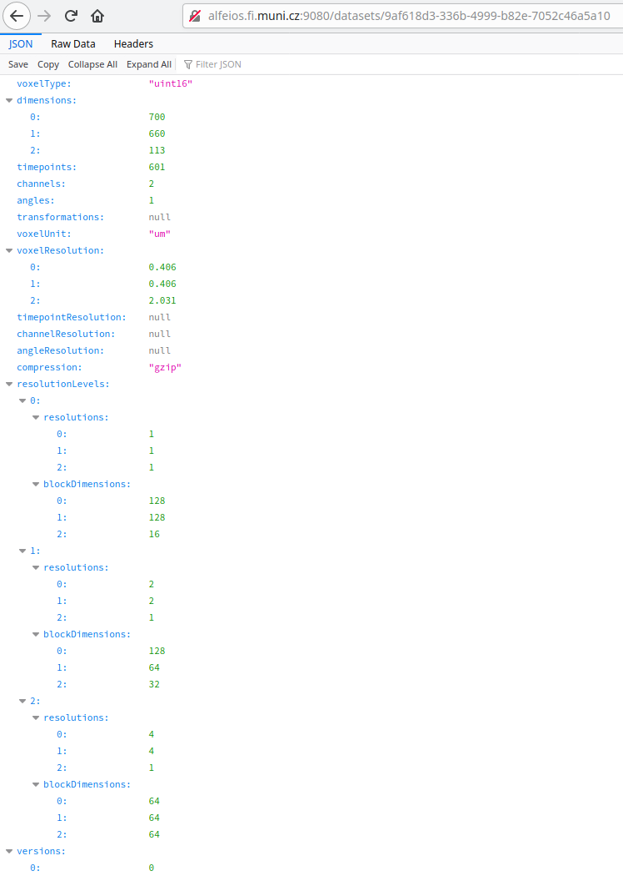

# Features

## Server-side Auto Pyramids
This is a very much wanted functionality that is, *at the moment*, implemented as a prototype
and thus not easily accessible from the outside. If you have time and interest, you are welcome to
help us -> drop us a line, please, on: ulman@fi.muni.cz

## Client-side Auto Pyramids
This is implemented (and can be turned off if desired) in the plugin Fiji -> Plugins -> HPC DataStore -> Write full image.


As shown above, if the checkbox "Write also lower resolutions" is clicked, the plugin writes the currently opened
image to DataStore to the indicated resolution level, then it internally makes a copy of the opened image which is transfered
to the next lower resolution level of the dataset and this repeats until the most downscaled-level is reached. The plugin
(intentionally) does not upscale and thus, following still this example, the finest resolution level "[1,1,1]" is not touched in here.

## Mixing of Versions
[The DataStore supports versioning of image data](DESCRIPTION.md#versions-of-data), a very basic one though.
Considering a multi-channel dataset, one can work on individual channels and deliver newer versions
of the image data, e.g., by de-noising the raw channel or improving segmentation channel. This, however,
leads to a situation that each channel holds different number of its revisions/versions. To prevent from
"house-keeping efforts" or data duplication, which one would use to "fill missing versions" in some channels
to bring all channels to one common "latest" version, the DataStore allows to request fetching of image chunks
from different versions, in particular each chunk at its latest available version.

This happens transparently on the server-side, client only needs to choose version `mixedLatest`.

## Querying the DataStore Server
[Similar to fetching the XML for BigDataViewer](APPLICATIONS.md#bdv-opens-tailored-xml)
one can query the DataStore server about datasets parameters.

This can be achieved **via Fiji**, go to Plugins -> HPC DataStore -> Query -> Dataset info.
A console window should pop up (if not, go to Window -> Console) and should summarize the dataset parameters.

Alternatively, the querying can be achieved by opening the URL

```
http://HOST:PORT/datasets/DATASETID
```

**in a web browser**. The `HOST:PORT` is an address to where the relevant *DatasetsRegisterService* is running,
and the `DATASETID` is the name of the queried dataset.

The server returns a JSON file, which makes it easy to parse by machine and which many browsers
today can display in a human-readable form as well. The content is hopefully self-explaining,
[or this docs may help](https://docs.google.com/document/d/1ZeLc83dyNE9USBuvSCLEVGK-zQzUKFb7VGhOlVIRBvU/edit):



If the dataset is not recognized on the server, it responds a line similar to this:

```
Dataset with UUID = 9af618d3-336b-4999-b82e-7052c46a5a11 not found
```

## Adding a New Channel to Existing Dataset
Yes, it is possible to add a channel into an existing dataset [quite easily without a need to any rebuilding of
image data](HISTORY.md). The server only updates its own [internal copies of all BDV's XML files `export.xml`](DESCRIPTION.md#the-bdv-dialect).
If the modified dataset was simultaneously inspected by some BigDataViewer instance, that instance would need to
be restarted on [fresh XML file](APPLICATIONS.md#bdv-opens-tailored-xml) to make it notice the new channel.
The newly added channel is, however, started empty/dark, it is not a clone of anything.

[Check the How-Tos section.](HOWTO.md#adding-a-new-channel)

## Own Dataset Title and Metadata
Although not available yet among [the Fiji client plugins](https://github.com/fiji-hpc/hpc-datastore-fiji),
the DataStore supports a "text area"-like (list of strings) attribute, and adding own labels
is underway...

## Zarr and NGFF Compatibility
[Despite discussed elsewhere in this documentation](DESCRIPTION.md#n5-zarr-and-ngff), it is not implemented yet.
